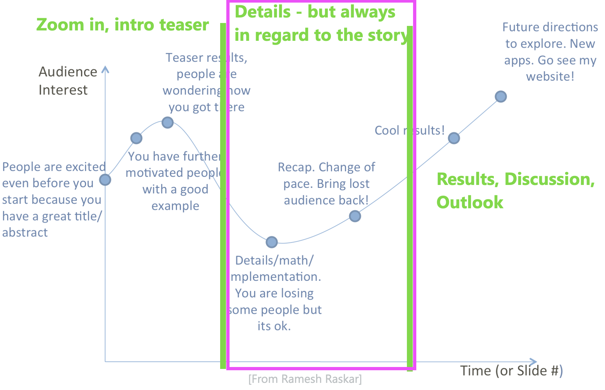
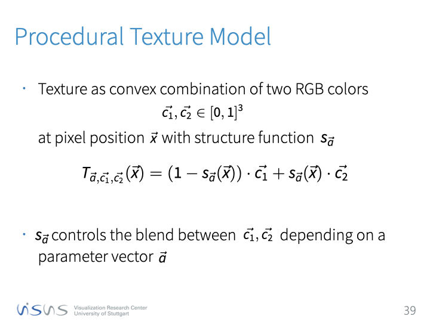
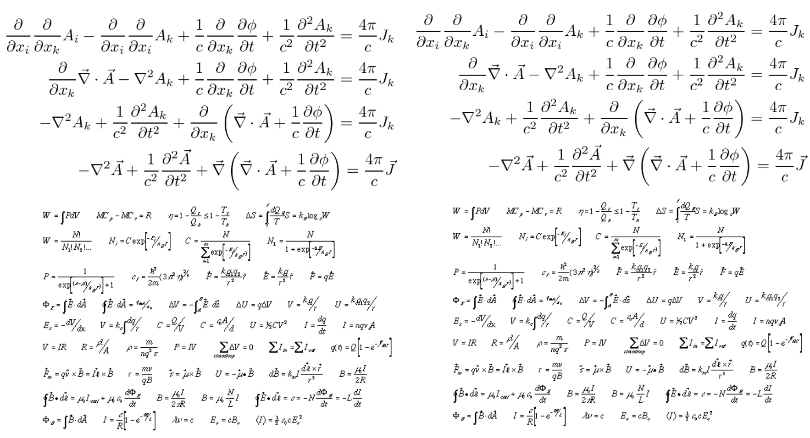

name: inverse
layout: true
class: center, middle, inverse
---

# How To Give a (Research) Talk

### Prof. Dr. Lena Gieseke | l.gieseke@filmuniversitaet.de  

#### Film University Babelsberg KONRAD WOLF
  

---
layout:false

## Topics

--
* Getting started

--
* Anatomy of a talk

--
* Layout

--
* Delivering the talk

--
* Q&A

---
.center[]

---
.center[]

---

## Learning Objectives

--
* Recognizing the decisive aspects of talk

--
* Make deliberate decisions about your talk

--
* Control how you and your talk are received

---

## References

*How to give a good (research) talk!*  
Dr. Diego Gutierrez, Universidad de Zaragoza
  
 
  
Further acknowledgments
* Ramesh Raskar
* Fredo Durand
* Jim Blinn

---
template:inverse

# Getting Started

---

## Getting Started

What type of talk are you giving to whom?

--

* Summary vs. proposal
* One topic vs. many topics
* Deep vs. overview
* Intellectual vs. intuitive
* Experts vs. casual listeners

--

Which audience response do you want?

--

* Emotional vs. knowledge

---

## Getting Started

.left-even[
> Facts don’t move people,   
> emotions do!

]
.right-even[
.center[]
]

---

## Getting Started

.left-even[
> Facts don’t move people,   
> emotions do!

*(E-) motion*
* Excitement
* Curiosity
* Sympathy
* Hope
* …
]
.right-even[
.center[]
]

---

## Getting Started

> Know with what and whom you are dealing with!
  
 
--
  
Today's scenario:

* Research talk based on a already reviewed and accepted paper
    * Complex topic, neutral tone
* Many aspects are generalizable

--

> Telling a story about the given content.

---
.header[Getting Started]

## Timing

--

* Know the time that you have

---
.header[Getting Started]

## Timing

* Know the time that you have

#**Deliver the given time!**

---
.header[Getting Started]

## Timing

* Know the time that you have
* Deliver the given time!

--
* Talking too long is a deadly sin

--
    * Chance of being cut of
    * Everyone will remember that and not your talk
--
* Talking too short reflects bad on your work

--

> Being off time is usually due to missing preparation and practice.

---
.header[Getting Started]

## Timing 😱

> How am I going to tell everything in only 20 minutes?

--

That is your main task to solve!

---
.header[Getting Started | Timing]

## Developing Content

* Leave stuff out. Don’t get lost in the details…

---
.header[Getting Started | Timing]

## Developing Content

--

* Tell a story

--
    * Everything else needs to follow the storyline  
--
    * If something doesn't add to or integrate, out with it 
--
* Create a take-home message

--
    * What is in it for the audience?
???
.task[COMMENT:]  

* I usually start with developing a take-home message
--
    * This is difficult

--

> You always want a positive emotional response 😍

---
layout:false

## Topics

* Getting started ✓
* **Anatomy of a talk**
* Layout
* Delivering the talk

---
template:inverse

# Anatomy of a Talk

---
.header[Anatomy of a Talk]

## Your (default) Audience Response...

---

.center[]

---

.center[]

---

.center[]

---

.center[]

---

.center[]

---

.center[]

---

.center[]

---
.header[Anatomy of a Talk]

## Your (wanted) Audience Response...

---

.center[]

---

.center[]

---

.center[]

---

.center[]

---

.center[]

---

.center[]

---

.center[]

---

.center[]

---

.center[]

---
## Anatomy of a Talk

.center[]

---
## Anatomy of a Talk

.center[]

---
## Anatomy of a Talk

.center[]

---
## Anatomy of a Talk

.center[]

---
## Anatomy of a Talk

.center[]

---
## Anatomy of a Talk

.center[]

---
.header[Anatomy of a Talk]

## Motivate Your Audience

> Answer the *whys* before you explain the *hows*.  
  

  
--
  
* Why is the problem important / interesting?

--
* Why is it difficult?

--
* What is a key insight in your talk?

--
* What benefit / gain has the audience from listening to you?

---
.header[Anatomy of a Talk]

## Motivate Your Audience

.left-even[
> Facts don’t move people,   
> emotions do!

]
.right-even[
.center[]
]

---
.header[Anatomy of a Talk | ]

## The Movie 2012

* 2012 is a movie about natural catastrophes, directed by Ronald Emmerich and distributed by Columbia pictures. The shooting began in 2008 in Vancouver, and it premiered a bit later than expected
* The Earth, as predicted by the Mayan calendar, will be destroyed in 2012, due to some huge solar storm that will cause a series of fatal reactions which…..

???
* Example: Motivate Your Audience

---

.center[]

---
.header[Anatomy of a Talk]

## Motivate Your Audience

* Don’t start in a boring way
    * Drop the index slide up front
--
* Show me something that catches my attention
    * Start showing a (cool) result
    * Think of it as of a movie trailer

???
.task[COMMENT:]  

* If you can’t think of anything exciting to say about your research…it may be time to change topics?

--

> Before diving into the details repeat one more time the storyline (*the why*).

???
* Don't rely on people having heard you title once and then know what your talk is about

---
## Anatomy of a Talk

.center[]

---
.header[Anatomy of a Talk]

## The Details

> A bit of a downhill slide…

--

* You’re going to lose parts of the audience
    * It’s unavoidable

--
*On a side note*:
  
* Be positive (and brief) when discussing related work
    * Use it only to contextualize your work
    * What gap is your work addressing?

---
.header[Anatomy of a Talk]

## The Details

* Add complexity (e.g., theories, equations, algorithms, diagrams) in a sensible way

--
    * Walk your audience through them
    * Can you use animations?	
    * Break the scenario into simpler chunks

---

.center[]

---
.header[Anatomy of a Talk]

## The Details

* You will not be able to explain all the details
    * Reference people to your paper / proposal
--
* Structure the information in layers
    * Add details for a few chosen ones
    * But don’t lose the rest for too long

--

> Build recovery points; summarize; give your audience breaks...

---
.header[Anatomy of a Talk]

## The Details

.center[]

---
## Anatomy of a Talk

.center[]

---
.header[Anatomy of a Talk]

## Results

* It’s OK to use the same results from the beginning

--
* And then some more of course!
    * Show many, many results
    * Show a range - what worked well, what didn’t
    * Refer to abnormalities, etc.
--
    * …but try to leave your audience wanting more
--
* Don’t end with (sad) limitations  

--
* End on a positive note

---
.header[Anatomy of a Talk]

## Ending The Talk…

* Reconsider a “Thank you” or “Questions?” slide in the end
    * It’s boring… and this is what will stare at the longest during Q&A

???
.task[COMMENT:]  

* But do thank your audience!

--
* Take-home message
* Summary of the work
* Website for additional info
* Cool results

---
.center[]

---
.header[Anatomy of a Talk]

## Structuring

--
* Develop a structure

--
    * The structure and layout of the reference, e.g., your paper, is not necessarily the best layout for the presentation
--
* Communicate the structure to your audience

---
.header[Anatomy of a Talk]

## Communicate the Structure

.left-even[
* Introduction
* Previous work
* Our algorithm
    * Part A
    * Part B
    * Part C
* Results
* Conclusions
* Future Work
* Questions
]
--
.right-even[
    
]

---
.header[Anatomy of a Talk]

## Communicate the Structure

* Use visual guides, e.g. in the heading

--
* Use a pipeline / process image to guide through the talk

--
* Use the structure to build recovery points
    * Summarize aspects covered so far
    * Show where we are in the story

---
.header[Anatomy of a Talk]

## Content

Example

---

.center[]

---

.center[]

???
.task[COMMENT:]  

* Adressing two tone texture models… 

---

.center[]

???
.task[COMMENT:]  

* Principal Component Analysis reveals the constituent colors and a corresponding blend map. 

---

.center[]

???
.task[COMMENT:]  

*  By identifying the most similar image from a database of images generated by a procedural texture model according to a texture descriptor, we can retrieve structural parameters. 

---

.center[]

???
.task[COMMENT:]  

* Together with the colors, they produce an image closely matching the input. 

---

.center[]

---

.center[]

???
.task[COMMENT:]  

* We consider two-tone texture models that blend between two colors with a convex interpolation based on a structure function and this function depends on several structural parameters. We do not make and further restrictions on the design of texture model. 

---

.center[]

---

.center[]

---

.center[]

???
.task[COMMENT:]  

* By using two-tone texture models we assume that the input picture shows a two-tone texture also.  This implies that the distribution of its color values in the RGB cube follows a straight line.  A principal component analysis (PCA) of the color values reveals the line's location as the first principal component (the one corresponding to the eigenvector of the covariance matrix with the largest eigenvalue). The extremal pixel values of the input picture define its two constituent tones An affine transformation maps the color with the smaller luminance value to 0 and the greater one to 1. I f the luminance comparison fails, we use the three channels in lexicographical order for comparison. This mapping transforms the input picture to a gray valued structural image s_target and we can proceed with matching this structural information. The determined tones c_1 and c_2 constitute the final colors for the texture program. For input images that deviate from the two-tone assumption, the pixel values are projected onto the straight line c_1 c_2. As the projected values may fall outside the RGB unit cube, we chose the intersection points of the line with the RGB cube as the two constituent colors. 

---

.center[]

---

.center[]

---

.center[]

???
.task[COMMENT:]  

* As we follow a generalized approach with a variety of possible input images and texture models we are looking to define image similarity or rather distance based on appearance not pixel values. In order to achieve interactive performance, we want to allow for fast numerical search, derived from being compactly storable, which we can do by abstracting the texture input sufficiently while maintaining features that are relevant for a human observer. Global statistics: overall brightness and contrast Frequencies and their distributions: corresponding to structural orientations We formulate a metric incorporating both types into a descriptor vector which can be independently computed per input image and compactly stored 

---
layout:false

## Topics

* Getting started ✓
* Anatomy of a talk ✓
* **Layout**
* Delivering the talk

---
template:inverse

# Layout

---
.header[Layout]

## Media

???
.task[COMMENT:]  

* What is the main medium of your presentation?

--

.center[]

---
.header[Layout]

## Media

.left-even[
]
.right-even[
# You are the main medium!
]

---
.header[Layout]

## Media

.left-even[
]
.right-even[
You are the main medium!  

> The slides should support you!
]

---
.header[Layout]

## Visual Layout

--

* Don’t clutter your slides

--
    * Just add more slides!

---
.header[Layout]

## Visual Layout

* I will dive straight into the problem, assuming you know as much as I do about the topic in general and the specific problems I’m trying to solve in particular
* I will throw my solutions at you without a warning, without any motivation, or any insight about the key observations that lead to the proposed solution
* I will also write Every. Single. Word. I will articulate, thus limiting myself to simply reading the slides, while filling the space with lots and lots of words that you may or may not read but hey words are free right? So why not keep typing until I simply run out of space and then I’ll just add a new slide and continue
* My solution could make the world a better place but no-one will know about my ideas because I gave such a bad presentation that made everybody dislike the topic.

---
.header[Layout]

## Visual Layout

* Use simple sentences, one idea per sentence

--
* Large fonts: 20-point and higher

--
* ~ Six lines per slide

---
.header[Layout]

## Visual Layout

--
* Check your spelling
* Keep it grammatically sane

--
* Be consistent with your fonts and style
    * Start bullets with upper case?

---
.header[Layout]

## Visual Clutter

.center[]

---
.header[Layout]

## Visual Layout

.center[]

---
.header[Layout]

## Visual Layout

.left-even[]

.right-even[
* Always guide your audience
    * E.g. build up graphical elements
]

---
.header[Layout]

## Visual Layout

.left-even[]

.right-even[
* Always guide your audience
    * E.g. build up graphical elements
* Otherwise they get distracted in the best case and frustrated in the worst case
]

---
.header[Layout]

## Visual Layout

.left-even[]

.right-even[
> Refer to everything on the slide orally.
]

???
  
TODO: start example

---
.header[Terminology]

## Clean Energy

* Energy from renewable, non-fossil energy sources  
  

.center[]

.footnote[[Natural Resources Defense Council. 2022. *Renewable Energy: The Clean Facts*. Data, Reports & Resources.] [Img: SPEC Corporation Website]]
  

???
  

...clean energy - unter der man vor allem Energie aus erneuerbaren, nicht-fossilen Energiequellen wie Wind, Sonne, Wasserkraft und Erdwärme versteht.

---
.header[Terminology]

## Clean Energy

* Energy from renewable, non-fossil energy sources 
  

.center[]

.footnote[[Natural Resources Defense Council. 2022. *Renewable Energy: The Clean Facts*. Data, Reports & Resources.] [Img: Dong Nhat Huy, Adobe Stock]]

---
.header[Terminology]

## Clean Energy

* Energy from renewable, non-fossil energy sources 
  

.center[   
  ]

.footnote[[Natural Resources Defense Council. 2022. *Renewable Energy: The Clean Facts*. Data, Reports & Resources.] [Imgs: bbc, atural-resources.canada.ca, nytimes, global.toshiba ]]

---
.header[Layout | Visual Layout]

## Media

* Ideally have all files downloaded

  
   
--

* It is a convention to include a sources or reference for each media element.

---
.header[Layout]

## Design

--
* Think about the design

--
    * Does it complement the content and your story?
--
    * How does it reflect on you?

--

> The visual design should match your storyline.

---

.center[]

---

.center[]

---

.center[]

---
.header[Layout]

## Visual Layout

--
* Be aware of low quality projectors and possible light conditions

--
* Black vs. white background?
    * Personal taste
    * Use the opposite of the natural background for creating a framing

---
.header[Layout]

## Visual Layout 😱

* Layouting is a time trap - be aware!

---
.header[Layout]

## Visual Layout 🤬

* Keep emojis to a minimum

--
...or not.

---
layout:false

## Topics

* Getting started ✓
* Anatomy of a talk ✓
* Layout ✓
* **Delivering the talk**

---
template:inverse

# Delivering the Talk

---
.header[Delivering the Talk]

## Media

.left-even[
]
.right-even[
# You are the main medium!
]

---
.header[Delivering the Talk]

## Media

You are the main medium!

* Make use of it

--
* Communicate with your audience
    * Focus on communicating rather than performing 
--
    * It depends...

--

> The slides should support you!

---
.header[Delivering the Talk]

## Getting Prepared

--

* Practice, practice, practice… 

--
    * This is the only way to know your timing
--
    * This will make you self-confident
--
* Reading pre-written, practiced text usually works well

--
* Add moments for going off script

---
.header[Delivering the Talk]

## Getting Prepared

* Practice in front of an audience
    * Listen to their feedback
???
.task[COMMENT:]  

* Feedback in terms of content AND in terms of the presentation and formal aspects

--
* If they didn’t get it, it’s your fault!

---
.header[Delivering the Talk]

## You are the main medium!

.center[]

---
.header[Delivering the Talk]

## You are the main medium!

* Be present

--
* Your attitude, tone of voice, rhythm… it all counts

--
* Cloths do matter
    * Wear something as comfortable as possible
    * Don’t distract your audience

---
.header[Delivering the Talk]

## You are the main medium!

* Be confident

--
    * Fake it…
--
* Believe and like what you talk about

--
* Show enthusiasm

---

## Delivering The Talk

> Don't start with any negative announcement..  
  

--
* I didn’t have time to prepare…
* I have a jetlag
* To little time for the topic
* This is going to be boring...
  
--
  
> Just keep it inside and be confident.

--

* If you must, say it after the talk

---

## Delivering The Talk

* **Be authentic**

--
    * This usually means vulnerable

---
## Delivering The Talk

* Stand whenever possible

???
.task[COMMENT:]  

* This is scary, I know…

--
* Walk up to the slides but do not turn to them
* Use a pointer / mouse

--
* For the shorter ones: does the speaker table fit your size?

---
## Delivering The Talk

* Know the specific setup for your talk in advance

--
    * Are you able to see your notes?
    * Do you have to hold a micro? …and a presenter?

???
.task[COMMENT:]  

* Visualize yourself in the setup
    * E.g., walking up to the podium, starting the talk, etc. 
    * Helps against nervousness

---

## Delivering The Talk

* Look at the people
    * Not your monitor, not the screen
    * Don’t be intimidated by facial expressions (they are usually completely random)

---

## Delivering The Talk

* Better leave out stuff, than rush

--
    * Always!
    * Make navigation jumps
    * Don't let the audience see what they are missing

---

## Delivering The Talk

* Don't oversell
    * Be honest with the scope of your contribution / achievement / proposal
    * Again, be authentic
--
* Don’t take all the credit
    * Avoid the me, myself and I

---

## Delivering The Talk

--
* If you make a mistake, say so and start over

--
* If there is an interruption, acknowledge it

---

## Delivering The Talk

* Make pauses, change pace, vary intonation
    * Ask for feedback
    * Practice
--
* Have transitions between topics, e.g., breath, take a sip of water

---

## Delivering The Talk

* Start with the beginning of the sentence before switching the slide

--

> Be in sync with what is on the slide!
  
--
  
* Use similar wording
* Integrate the bullet points into your spoken sentences

---
layout:false

## Topics

* Getting started ✓
* Anatomy of a talk ✓
* Layout ✓
* Delivering the talk ✓
* **Q&A**

---
template:inverse

# Q&A

---

## Q&A

--
* Concentrate

--
    * Consider taking notes

???
.task[COMMENT:]  

* Be confident

--
* It is ok to ask them to repeat, or repeat yourself

--
* If you don’t know the answer, simply say so

--
* If it gets too involved, take the discussion off-line and move on
    * The chair should help you with this

---
layout:false

## Topics

* Getting started ✓
* Anatomy of a talk ✓
* Layout ✓
* Delivering the talk ✓

---
template:inverse

# Summary

---

## In Summary

### Take Home Messages 😁

--
* You are the main medium

--
* Choose your message, tell a story

--
* Motivation, motivation, motivation

--
* Structure your talk

--
* Avoid lengthy derivations of the details

--
* Build recovery points

--
* End your talk in a positive way

--
* Deliver the given time

---
template: inverse

# The End
# ⭐️
